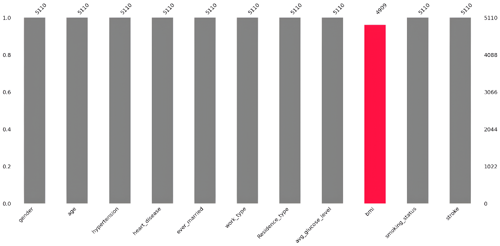
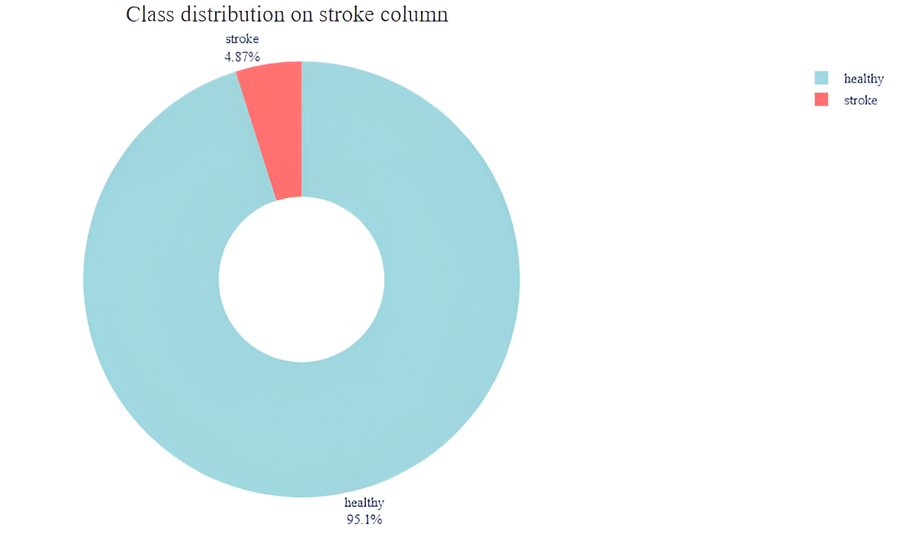
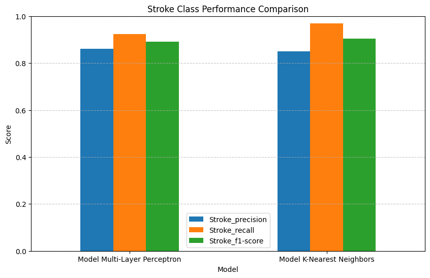

# 🧠 Stroke Prediction Using Machine Learning

This project focuses on predicting **stroke occurrence** using patient healthcare data and machine learning techniques.  
The objective is to build a reliable classification model by handling missing values, addressing class imbalance, and evaluating model performance using appropriate metrics.

This project is designed as a **portfolio project** to demonstrate end-to-end machine learning workflow in a healthcare context.

---

## 📌 Project Objective
- Predict stroke occurrence using healthcare data  
- Handle missing values and imbalanced classes  
- Compare machine learning model performance  
- Visualize key evaluation results  

---

## 🧰 Tools & Technologies
- Python  
- Google Colab  
- Pandas & NumPy  
- Scikit-learn  
- Imbalanced-learn (SMOTE)  
- Matplotlib, Seaborn  
- Missingno  

---

## 📂 Dataset Overview
**Dataset:** Healthcare Stroke Dataset  

**Key Features:**
- Age, Gender, BMI  
- Average glucose level  
- Work type, Smoking status  
- Residence type  

**Target Variable:**
- `stroke = 1` → Stroke  
- `stroke = 0` → Healthy  

---

## ⚙️ Workflow Summary
1. Data loading and exploration  
2. Missing value analysis  
3. Missing value handling using **KNN Imputer**  
4. Feature encoding and scaling  
5. Class imbalance handling using **SMOTE**  
6. Model training (MLP & KNN)  
7. Model evaluation and visualization  

---

## 🧠 Machine Learning Models
- **Multi-Layer Perceptron (MLP)**  
- **K-Nearest Neighbors (KNN)**  

---

## 📊 Key Visualizations

### 🔍 Visualize Missing Values
Missing value distribution before preprocessing:

---

### ⚖️ Class Distribution on Stroke Column
Class imbalance before and after applying SMOTE:

---

### 📈 Stroke Class Performance Comparison
Comparison of **precision, recall, and F1-score** for stroke prediction:

**Insights:**
- Both models show strong performance after class balancing  
- **MLP** demonstrates stable generalization  
- **KNN** achieves slightly higher F1-score for stroke detection  
- Recall is prioritized to minimize false negatives in medical prediction  

---

## ✅ Project Output & Results

### 🧪 Data Processing Output
- Missing values successfully handled using **KNN Imputer**
- Numerical features scaled to improve model convergence
- Severe class imbalance resolved using **SMOTE**

---

### 🤖 Model Performance Output
- Both MLP and KNN achieved high classification performance after balancing
- **MLP** shows consistent and stable results across evaluation metrics
- **KNN** performs competitively with strong stroke detection capability

---

### 📊 Evaluation Output
- Model evaluation metrics include **accuracy, precision, recall, and F1-score**
- Metrics were saved as a CSV file (`Final_Model_Results.csv`)
- Visualization highlights the importance of **recall and F1-score** in healthcare prediction tasks

---

## 🧠 Key Takeaway
> *This project demonstrates how proper preprocessing, class balancing, and metric visualization significantly improve machine learning performance in imbalanced healthcare datasets such as stroke prediction.*

---

## 🚀 How to Run
1. Open the notebook in Google Colab  
2. Upload the dataset file:  
   `healthcare-dataset-stroke-data.csv`  
3. Run all cells sequentially  
